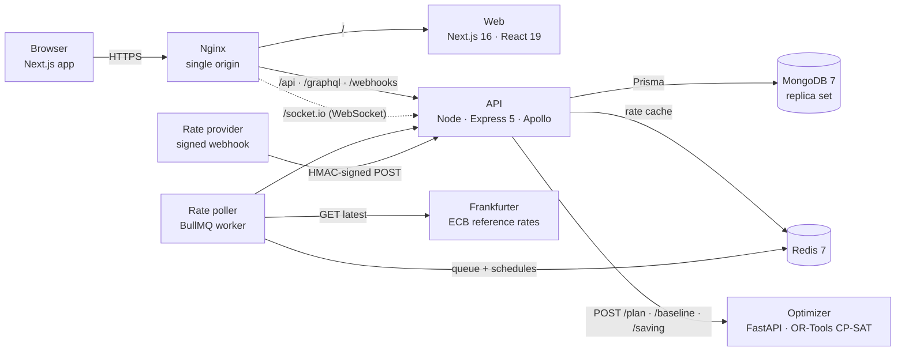
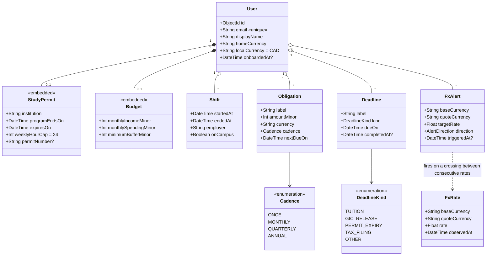
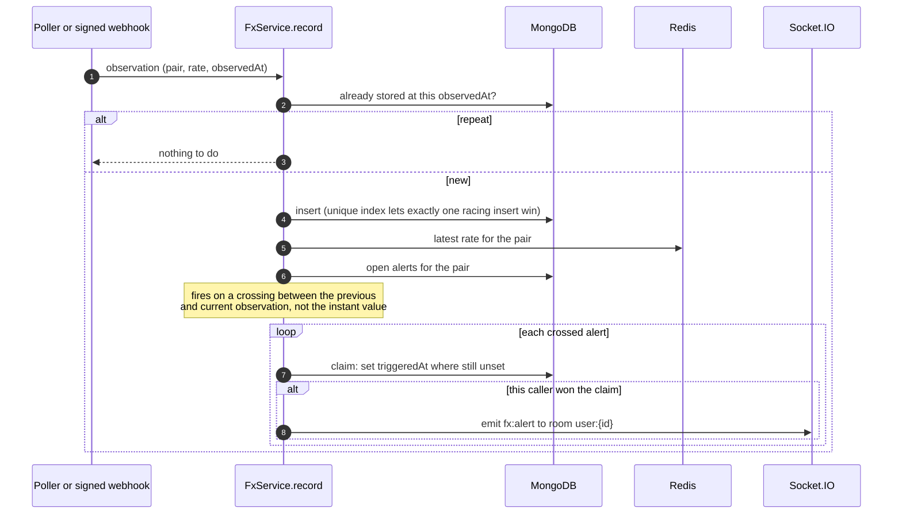
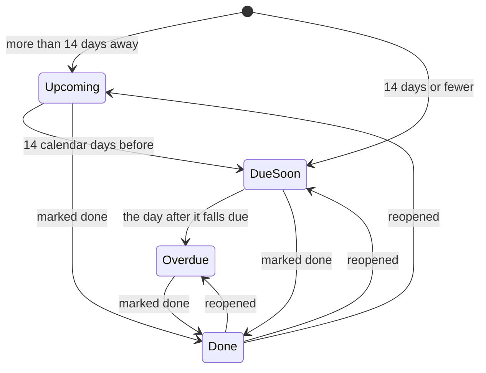

# FundEd — UML and architecture diagrams

Written in Mermaid so they render on GitHub and live next to the code they describe. Each
one is drawn from the implementation as it stands, not from a plan.

## 1. Components



The poller runs inside the API process today. It is drawn separately because it is a separate
concern, and moving it to its own container needs no code change.

## 2. Domain model (class diagram)



`FxRate` carries a unique index on (baseCurrency, quoteCurrency, observedAt). All money is an
integer in minor units; only exchange rates are floats. The schema also defines a
`TransferPlan` model that nothing writes to yet, so it is omitted here.

## 3. Building a transfer plan (sequence)

```mermaid
sequenceDiagram
  autonumber
  actor Student
  participant Web as Web (PlanPanel)
  participant API as API /api/plan
  participant Repo as ObligationRepository
  participant Opt as Optimizer

  Student->>Web: balance, fees, assumed rate, horizon
  Note over Web: monthly budget converted to daily periods
  Web->>API: POST /api/plan
  API->>Repo: occurrencesFor(user, start, end)
  Repo-->>API: cadences expanded into dated amounts
  alt nothing falls due
    API-->>Web: 422 nothing_to_plan
  else something to plan
    par solved together
      API->>Opt: POST /plan (CP-SAT)
      API->>Opt: POST /baseline (monthly transfers)
    end
    Opt-->>API: schedule, totals net of fees
    Opt-->>API: baseline totals
    alt optimizer down or times out
      API-->>Web: 503 optimiser_unavailable (rest of the API still works)
    else planned
      API-->>Web: 200 schedule + saving vs monthly
    end
  end
  Student->>Web: Estimate with rate swings
  Web->>API: POST /api/plan/saving
  API->>API: observed rates for the student's pair, oldest first
  alt fewer than 3 observed rates
    API-->>Web: 422 not_enough_history
  else enough history
    API->>Opt: POST /saving (40 bootstrapped rate paths)
    Opt-->>API: mean saving + 95% confidence interval
    API-->>Web: 200, rounded to whole minor units
  end
```

## 4. An exchange-rate alert firing (sequence)



## 5. Deadline status (state machine)



Days are counted between local calendar dates, so a daylight-saving change never turns three
days into 2.96.
